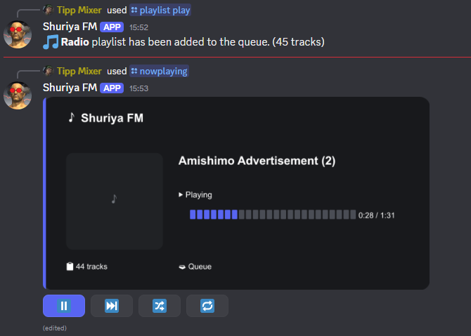
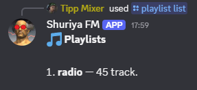

# 🎵 Shuriya FM

A lightweight Discord music/radio bot built with **Node.js**,
**discord.js**, and **@discordjs/voice**.

**ChatGPT assisted** project!

Shuriya FM is designed for a small private server / friend group: simple
playlist-based playback, a custom music-player UI, realtime progress
updates, and a Discord presence that shows the currently playing track.

## ✨ Features

-   🎵 Local MP3 playback
-   📻 Playlist-based radio playback
-   🎨 Embedded album artwork extraction from MP3 metadata
-   ▶️ Custom `/nowplaying` player card
-   📊 Realtime playback progress
-   ⏯️ Pause / resume
-   ⏭️ Skip
-   🔀 Shuffle
-   🔁 Track / queue loop modes
-   📋 Paginated `/queue` UI
-   🎧 Discord `Listening to ...` presence with the current track
-   🧹 `/cleanup` command for removing bot messages
-   🔎 Playlist autocomplete
-   🧩 Class/service/component based architecture
-   💾 No external music streaming service required

------------------------------------------------------------------------

## 🖼️ Screenshots

### Music player

The custom player displays the current track, artwork, progress, queue
size and playback controls.



### Discord profile presence

The currently playing track is also shown directly on the bot's Discord
profile.


### Playlist commands

Playlists are discovered automatically from the `audio/` directory.



------------------------------------------------------------------------

## 🏗️ Project structure

``` text
discord-music-bot/
├── audio/
│   └── playlist_name/
│       └── *.mp3
│
├── scripts/
│   └── deploy-commands.js
│
├── src/
│   ├── bot/
│   │   ├── DiscordBot.js
│   │   └── EventHandler.js
│   │
│   ├── commands/
│   │   ├── CommandHandler.js
│   │   ├── index.js
│   │   ├── general/
│   │   │   ├── ping.js
│   │   │   └── cleanup.js
│   │   └── music/
│   │       ├── join.js
│   │       ├── leave.js
│   │       ├── pause.js
│   │       ├── play.js
│   │       ├── queue.js
│   │       ├── resume.js
│   │       ├── skip.js
│   │       ├── stop.js
│   │       ├── playlist.js
│   │       ├── nowplaying.js
│   │       ├── shuffle.js
│   │       └── loop.js
│   │
│   ├── components/
│   │   └── music/
│   │       ├── MusicPlayerCardRenderer.js
│   │       ├── MusicPlayerButtons.js
│   │       ├── MusicPlayerUpdater.js
│   │       ├── QueueCardRenderer.js
│   │       └── QueueButtons.js
│   │
│   ├── config/
│   │   └── config.js
│   │
│   ├── constants/
│   │   └── LoopMode.js
│   │
│   ├── events/
│   │   ├── interactionCreate.js
│   │   └── ready.js
│   │
│   ├── music/
│   │   ├── GuildMusicPlayer.js
│   │   ├── MusicManager.js
│   │   ├── Queue.js
│   │   ├── Track.js
│   │   └── Playlist.js
│   │
│   ├── services/
│   │   ├── AudioService.js
│   │   ├── MetadataService.js
│   │   ├── PlaylistService.js
│   │   └── PresenceService.js
│   │
│   ├── utils/
│   │   └── StringUtils.js
│   │
│   └── index.js
│
├── .env
├── .gitignore
├── package.json
└── package-lock.json
```

The project intentionally keeps Discord commands, music state, services
and UI components separated instead of putting everything into
`index.js`.

------------------------------------------------------------------------

## 🎮 Commands

### General

  Command      Description
  ------------ ----------------------------------------------
  `/ping`      Check whether the bot is responding
  `/cleanup`   Delete bot messages from the current channel

### Music

  Command                   Description
  ------------------------- -----------------------------------
  `/join`                   Join the user's voice channel
  `/leave`                  Leave the current voice channel
  `/play`                   Play a local audio file
  `/pause`                  Pause playback
  `/resume`                 Resume playback
  `/skip`                   Skip the current track
  `/stop`                   Stop playback and clear the queue
  `/queue`                  Display the current queue
  `/shuffle`                Shuffle the queue
  `/loop`                   Change loop mode
  `/nowplaying`             Display the custom music player
  `/playlist list`          List available playlists
  `/playlist play <name>`   Add a playlist to the queue

Playlist names use Discord autocomplete and are loaded dynamically from
the `audio/` directory.

------------------------------------------------------------------------

## 📻 Playlists

Playlists are simply folders inside `audio/`.

For example:

``` text
audio/
├── radio/
│   ├── Track 01.mp3
│   ├── Track 02.mp3
│   └── Track 03.mp3
│
├── chill/
│   ├── Track 01.mp3
│   └── Track 02.mp3
│
└── test.mp3
```

Each directory is automatically detected as a playlist when the bot
starts.

The bot reads MP3 metadata using `music-metadata`.

Supported metadata includes:

-   title
-   artist
-   album
-   duration
-   embedded album artwork

If title/artist metadata is missing, Shuriya FM falls back to the
filename.

------------------------------------------------------------------------

## 🖥️ Custom player

The `/nowplaying` interface is rendered as a custom PNG instead of
relying on Discord's standard embed layout.

This makes it possible to place the album artwork exactly where the UI
needs it:

``` text
┌───────────────────────────────────────┐
│ 🎵 Shuriya FM                         │
│                                       │
│ ┌─────────┐  Artist - Track           │
│ │         │                            │
│ │ ARTWORK │  ▶ Playing                │
│ │         │  ███████░░░░  0:42 / 1:31│
│ │         │                            │
│ └─────────┘  📋 Queue                 │
└───────────────────────────────────────┘
```

The image is refreshed periodically while playback is active.

Playback buttons remain real Discord buttons, so the UI is interactive
rather than just decorative.

------------------------------------------------------------------------

## 🎧 Discord presence

The bot automatically updates its Discord presence whenever the current
track changes.

Example:

``` text
🎧 Amishimo Advertisement (2)
```

Discord then displays it as:

> Listening to Amishimo Advertisement (2)

The presence is updated when playback changes rather than continuously
polling the player.

------------------------------------------------------------------------

## 🔧 Installation

### 1. Clone the project

``` bash
git clone <your-repository-url>
cd discord-music-bot
```

### 2. Install dependencies

``` bash
npm install
```

### 3. Configure environment variables

Create a `.env` file:

``` env
DISCORD_TOKEN=your_bot_token
CLIENT_ID=your_client_id
GUILD_ID=your_guild_id
```

### 4. Add audio files

Place MP3 files or playlist folders inside:

``` text
audio/
```

### 5. Register slash commands

``` bash
npm run deploy
```

### 6. Start the bot

``` bash
npm start
```

------------------------------------------------------------------------

## 📦 Dependencies

-   `discord.js`
-   `@discordjs/voice`
-   `dotenv`
-   `ffmpeg-static`
-   `music-metadata`
-   `sharp`

`ffmpeg-static` provides the FFmpeg binary used for audio processing,
while `music-metadata` handles MP3 metadata and embedded artwork.

------------------------------------------------------------------------

## 🔐 Environment variables

Never commit `.env` or your Discord bot token.

Recommended `.gitignore` entries:

``` gitignore
.env
audio/*.*
node_modules/
```

The `audio/` directory can contain local/private music files, so it is
intentionally excluded from version control.

------------------------------------------------------------------------

## 🧠 Architecture

The main flow looks like this:

``` text
Discord interaction
        │
        ▼
 CommandHandler
        │
        ▼
 Music command
        │
        ▼
   MusicManager
        │
        ▼
GuildMusicPlayer
   │          │
   │          └── Queue
   │
   ├── AudioService
   ├── PresenceService
   └── MusicPlayerUpdater
                │
                ▼
        Custom UI renderer
```

This keeps playback logic independent from Discord command files and
makes the UI components reusable.

------------------------------------------------------------------------

## 🚀 Project philosophy

Shuriya FM is intentionally not trying to be an enormous public music
bot.

The goal is a small, clean and enjoyable bot for a private Discord
server:

> **Simple to use, easy to understand, and fun to extend.** 🎵

------------------------------------------------------------------------

## 📄 License

This project is intended for personal/private use.

Add your preferred license here if you decide to publish the project.
